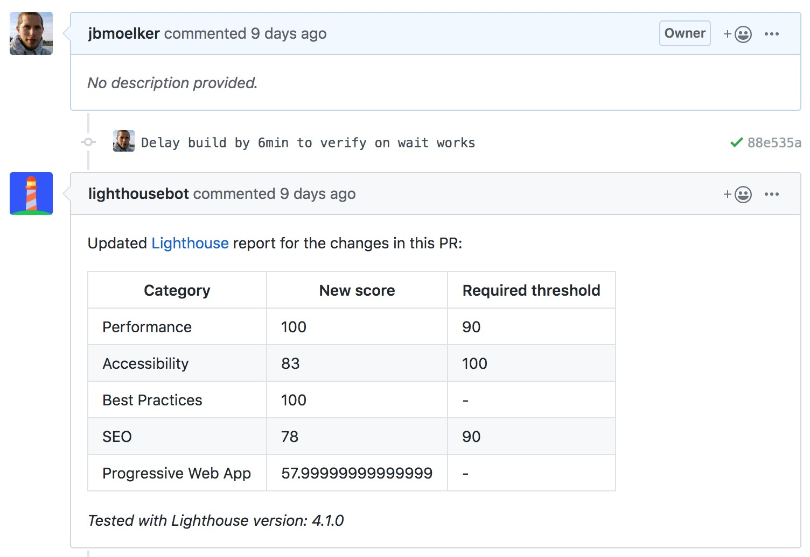

# Demo Travis wait on Netlify

Experiment to run [Lighthousebot](https://github.com/GoogleChromeLabs/lighthousebot) after [Netlify deploys](https://www.netlify.com/blog/2016/07/20/introducing-deploy-previews-in-netlify/) by [waiting for the deploy in Travis CI](.travis.yml).

While this experiment works, a cleaner solution is [triggering Lighthouse CI from a Netlify function on successful deploy](https://github.com/jbmoelker/demo-netlify-lighthouse-function).

## Result



See [example PR](https://github.com/jbmoelker/demo-travis-wait-on-netlify/pull/4).

## How it works

* Netlify builds and deploys site preview
* Meanwhile Travis CI starts and waits for Netlify deploy
* Then Travis CI run lighthousebot which runs Lighthouse CI and comments on PR

To ensure Travis waits for the new deploy, Netlify creates a unique file with the name of the commit SHA and Travis in turn waits for that file to be present:

```bash
NETLIFY_PREVIEW_SLUG="deploy-preview-$TRAVIS_PULL_REQUEST"
NETLIFY_PREVIEW_URL="https://$NETLIFY_PREVIEW_SLUG--lighthousebot-tests.netlify.com/"

npm run ci:wait -- "$NETLIFY_PREVIEW_URL$TRAVIS_PULL_REQUEST_SHA.txt"
npm run ci:lighthouse -- "$NETLIFY_PREVIEW_URL"
```
see [.travis.yml](https://github.com/jbmoelker/demo-travis-wait-on-netlify/blob/master/.travis.yml#L19-L20).